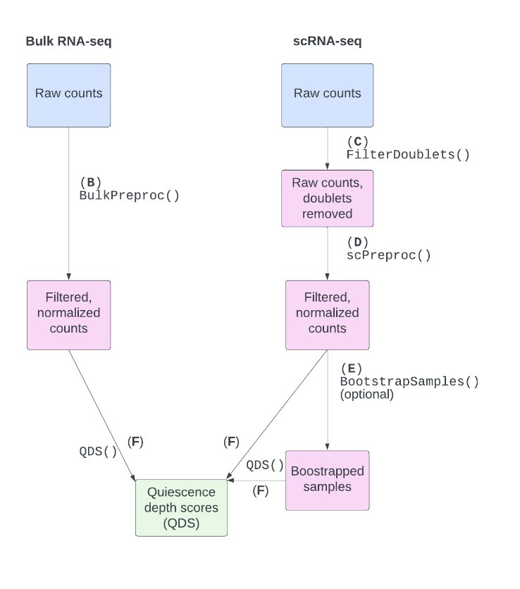

# QDSWorkflow
As cells age, they experience a decrease in proliferative signaling, 
which brings them closer to quiescence, or non-proliferation. 
We can build a "quiescence depth signature" (QDS) model by performing 
elastic net regression on samples in various stages of quiescence. 
The QDS model can then be used to predict the quiescence depth of other samples.  
The QDSWorkflow package contains functions for running quiescence depth analyses on bulk and scRNA-seq data. 

This [vignette](http://htmlpreview.github.io/?https://github.com/micw42/QDSWorkflow/blob/main/vignettes/introduction.html) contains two reproducible examples.

## Installation
To install this package, run the following in R:

```
remotes::install_github("micw42/QDSWorkflow")
```




